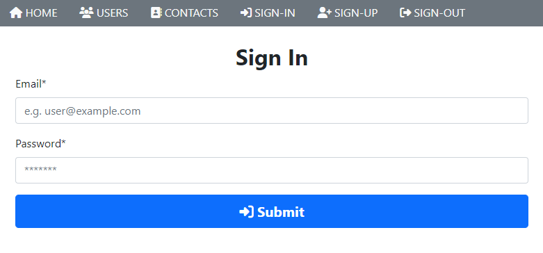
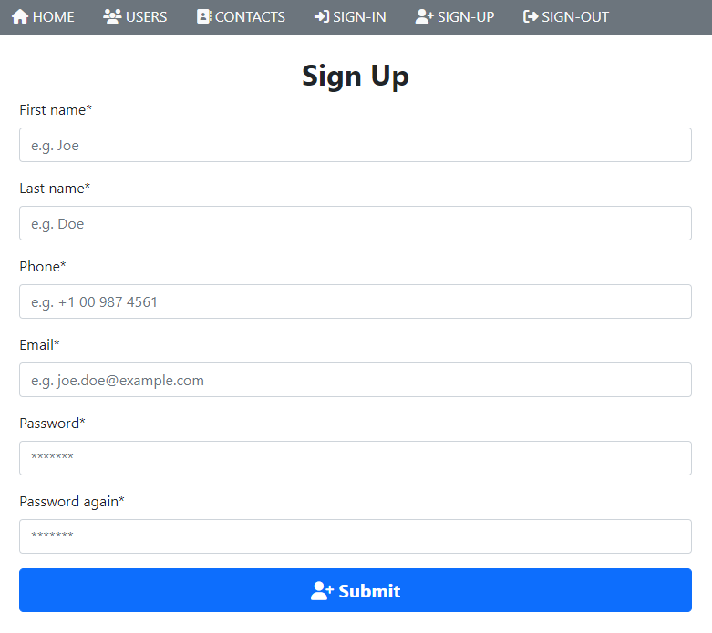
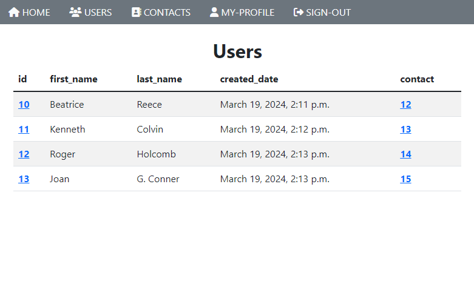
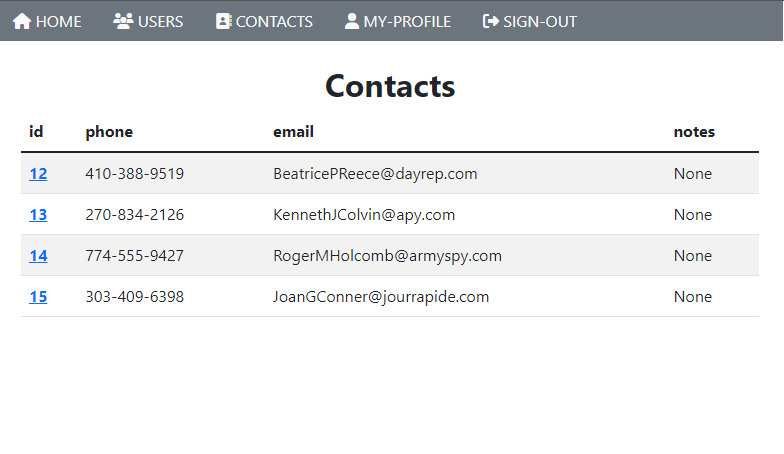

<p align="center">
    
    
    <br/>
    
    
</p>

# UserSys

A simple **Python / Django** project for managing Users on a **Postgres** database.

## How to run

```cmd
$ py -m pip install -r requirements.txt
$ py manage.py runserver 127.0.0.1:8080
```

## Admin page

Go to [http://127.0.0.1:8080/admin](http://127.0.0.1:8080/admin) and log in with the superuser:
```
Username: admin
Password: admin
Email: admin@example.com
```

## Practiced skills
* General Django
* Templating
* Models
* Generated forms
* User authentication
* Database with Django

## Apps used
* `bootstrap5`
* `crispy_forms`
* `argon2`

## Sitemap

* `/` - Show the sitemap links
* `/signup` - Sign Up a new user
* `/signin` - Sign In with a registered user
* `/signout` - Sign Out if authenticated
* `/user/users` - Lists out every user and a link to their contacts (table view with search func.)
* `/user?id=x` - A user and its all data including its contact
* `/contact/contacts` - Lists out every contact
* `/contact?id=x` - Shows all info about the contact
